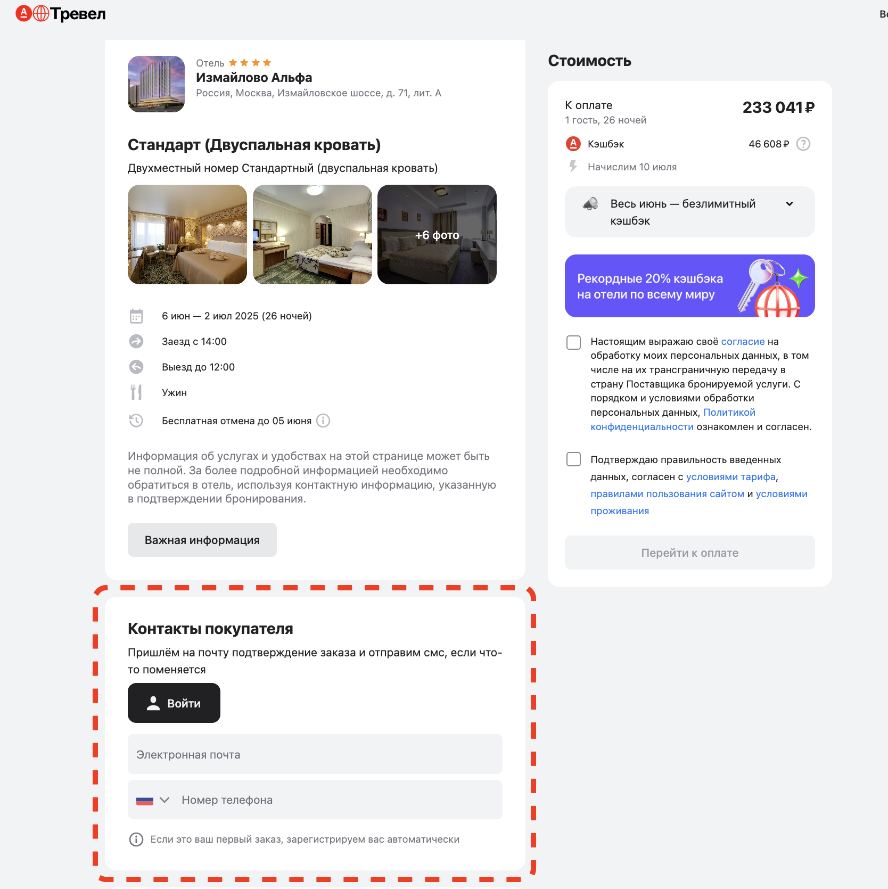
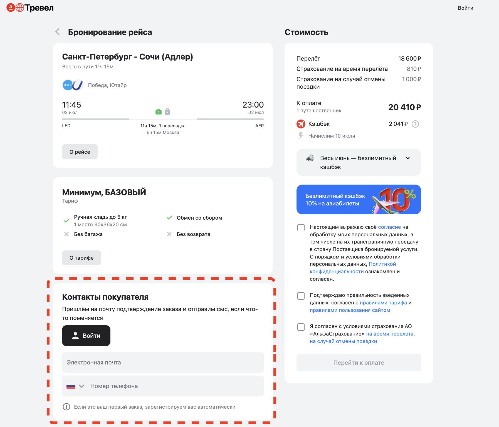

#  Про паттерн Composite Page Element
**Composite Page Element (Page Component/Component Pattern/Reusable Component)** - это приём, при котором отдельные части большой 
веб-страницы (например, хедер, футер, меню, форма входа и т.д.) выносятся в отдельные классы.

## Когда использовать?
- Когда страница содержит **повторяющиеся блоки**.
- Когда один и тот же элемент (например, форма входа) используется на **нескольких страницах**.
- Когда на странице много элементов в которых сложно разобраться и вы хотите повысить **читаемость кода**.

# Задача

На сайте https://travel.alfabank.ru/ есть функционал бронирования отелей и авиабилетов.
Страницы бронирования разные, но есть одинаковая форма заполнения контактов. Нужно реализовать заполнение этой формы.

# Решение без применения паттерна
[BookAviaPage](src/main/java/ru/nmt/pages/BookAviaPage.java)
[BookHotelPage](src/main/java/ru/nmt/pages/BookHotelPage.java)

## ❌ Минусы:
- Повторяющийся код.
- При изменении формы нужно изменять её в нескольких местах.
- Когда на странице много элементов, сложно в коде.

# Решение с применением паттерна Composite Page Element

## ✅ Плюсы:
- Разделение ответственности. Каждый класс отвечает за свой участок. 
- Переиспользование. Компонент можно использовать на разных страницах. 
- Поддерживаемость. Изменения в одном месте влияют на всё приложение. 
- Читаемость. Логика становится понятнее.